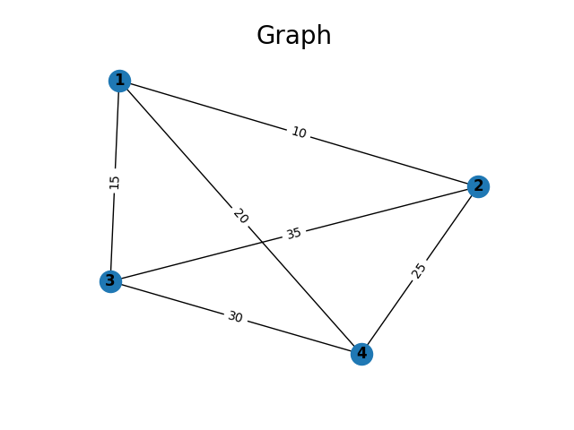
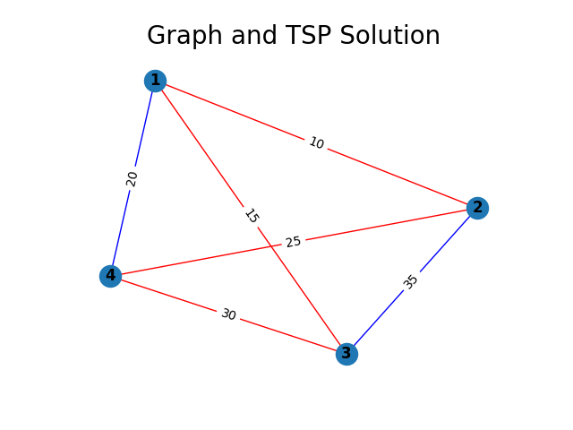

# tsp-dp
Basic dynamic programming solver for the Travelling Salesman Problem.

#### Usage


Create an undirected graph with distances as weights between vertices.
```py
graph = UndirectedGraph()
graph.add_nodes(
    ["1", "2", "3", "4"]
)

graph.add_edges(
    [
        ("1", "4", 20), ("1", "3", 15), ("4", "3", 30), ("2", "3", 35), ("1", "2", 10), ("2", "4", 25)
    ]
)
```


Use `TSPSolver` to calculate and visualize minimum-cost tour.
```py
solver = TSPSolver(graph)
cost, _, path = solver.solve()

print("Minimum-cost tour:", path) 
print("Cost:", cost)

# Minimum-cost tour: ['1', '2', '4', '3', '1']
# Cost: 80.0

graph.plot_overlay_TSP(solver)
```